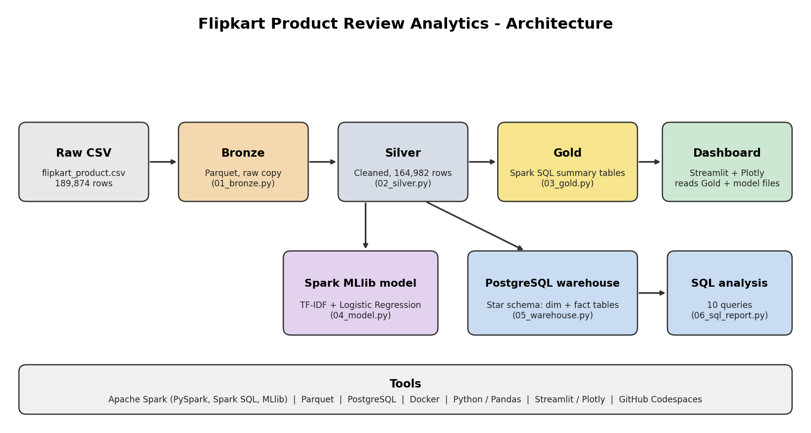

# Flipkart Product Review Analytics (BDA Mini Project)

Big Data Analytics mini project: analysing Flipkart product reviews with **PySpark**,
predicting review sentiment with **Spark MLlib**, storing the data in a **PostgreSQL star
schema**, and showing the results in a **Streamlit dashboard**.



## Tools used

| Tool | Used for |
|---|---|
| Apache Spark (PySpark) | Reading, cleaning and transforming the data (Bronze, Silver, Gold) |
| Spark SQL | Gold summary tables |
| Spark MLlib | Sentiment model (TF-IDF + Logistic Regression) |
| Apache Parquet | Storage format for the Bronze and Silver layers |
| Hive tables (Spark's built-in Hive support) | Partitioned table and HiveQL-style queries on one machine |
| PostgreSQL | Data warehouse (star schema with dimension and fact tables) |
| Docker (docker compose) | Runs PostgreSQL |
| Python, Pandas | Glue code and exports |
| Streamlit, Plotly | Dashboard |
| GitHub Codespaces, Git | Development environment and teamwork |

Apache Spark is used through PySpark in local mode on Ubuntu (GitHub Codespaces). Spark replaces Hadoop MapReduce for processing. No Hadoop cluster or HDFS is used.

## Pipeline

| Step | Script | What it does |
|---|---|---|
| 1. Bronze | `scripts/01_bronze.py` | Raw CSV to Parquet, no changes |
| 2. Silver | `scripts/02_silver.py` | Removes duplicates and broken rows, cleans price and text, adds sentiment, category, price band |
| 3. Gold | `scripts/03_gold.py` | Spark SQL summary tables in `data/gold/*.csv` |
| 4. Model | `scripts/04_model.py` | Trains the sentiment model, saves metrics and weights |
| 5. Warehouse | `scripts/05_warehouse.py` | Builds the star schema with Spark and loads it into PostgreSQL |
| 6. SQL analysis | `scripts/06_sql_report.py` | Runs 10 queries from `sql/analysis_queries.sql`, saves `docs/sql_results.txt` |
| 7. Benchmark | `scripts/07_benchmark.py` | Pandas vs Spark timing at two data sizes |
| 8. Hive tables | `scripts/08_hive_tables.py` | Stores Silver as a Hive table partitioned by category and queries it with Spark SQL |
| Dashboard | `dashboard/app.py` | Streamlit dashboard (reads only `data/gold/`) |

Warehouse tables: `dim_category`, `dim_product`, `dim_price_band`, `dim_sentiment`, `fact_reviews`
(see `sql/schema.sql`), plus the Gold tables as `gold_*`.

## How to run

Put `flipkart_product.csv` in `data/`, then from the repo root:

```bash
pip install -r requirements.txt          # Java is also needed for PySpark
bash run_pipeline.sh                     # steps 1 to 4
```

Warehouse (needs PostgreSQL):

```bash
docker compose up -d                     # starts PostgreSQL (user bda, password bda123, db reviews)
bash run_warehouse.sh                    # steps 5 and 6
```

If Docker is not available, install PostgreSQL directly instead of using docker compose:

```bash
sudo apt-get update && sudo apt-get install -y postgresql
sudo service postgresql start
sudo -u postgres psql -c "CREATE USER bda WITH PASSWORD 'bda123';" -c "CREATE DATABASE reviews OWNER bda;"
```

Optional steps and the dashboard:

```bash
python scripts/07_benchmark.py       # Pandas vs Spark timing
python scripts/08_hive_tables.py     # Hive table (needs data/silver, no PostgreSQL)
streamlit run dashboard/app.py
```

## For the dashboard teammate

Spark and PostgreSQL are **not** needed. The Gold tables are already in `data/gold/`:

```bash
pip install streamlit plotly pandas numpy
streamlit run dashboard/app.py
```

Edit `dashboard/app.py` for layout and design. If the pipeline is re-run, the Gold files
keep the same column names.

## Results (tested run)

- Bronze: 189,874 rows. Silver: 164,982 rows after removing 24,862 exact duplicates, 5 invalid ratings, and 25 rows with empty review text.
- Sentiment (from star rating): 126,243 positive (76.5%), 13,945 neutral (8.5%), and 24,794 negative (15.0%).
- 3-class model: 75.04% accuracy and 0.7852 weighted F1.
- Positive vs negative model: 92.15% accuracy and 0.9243 weighted F1.
- Neutral reviews are the hardest class to predict
- Scoring self-check: pure-Python scoring matched Spark on 500/500 reviews.
- PostgreSQL warehouse: 164,982 fact rows; all 164,982 matched a product. SQL analysis completed and results were saved to `docs/sql_results.txt`.
- Spark Hive-support table: `review_db.reviews` created with nine category partitions; category and price-band queries returned results.
- Benchmark on this run (seconds): 164,982 rows: Pandas 0.03, Spark 1 core 0.53, Spark 2 cores 0.39; 3,299,640 rows: Pandas 0.22, Spark 1 core 1.14, Spark 2 cores 0.99.
- Exact numbers can vary between runs and machines (including the random train/test split).

## Notes and limitations

- Data: Flipkart product reviews from Kaggle. Single platform, short reviews, no dates.
- The review title is not used as a model input because it is tied to the star rating.
- Categories are derived from product names with keyword rules, so a few products may be misfiled.
- Only about half of the review texts are unique, so accuracy may be slightly optimistic.
- Hive here means Spark's built-in Hive support on one machine.
- Not included (out of scope for a mini project): Airflow scheduling, an API and user login.
- See `docs/report_checklist.md` for what to screenshot for the report.
